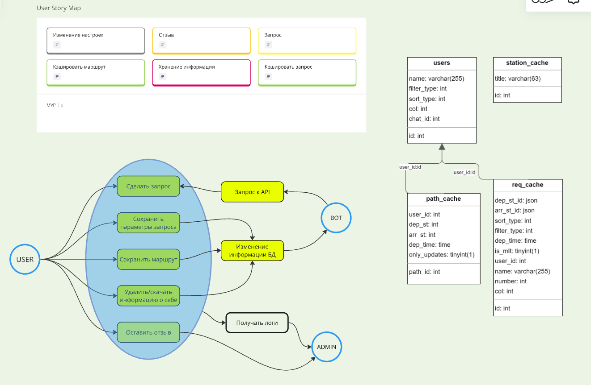

## Последняя формальность

Что я буду ждать от вас в итоговом отчете:

1. Название команды в любом формате
2. Описание идеи проекта
3. Функциональные возможности

    То есть то полное описание того, что пользователь может сделать в проекте. 

4. Технический стек проекта
   
   Использованные сторонние библиотеки/фреймворки

5. Участники проекта и их распределение баллов. 
   Рядом с именем и ролью каждого учатника должно быть указано, на какие **индивидуальные** баллы он требует. 

    То есть можно указать в формате 

> Володечева Григория [Разработчик]. 
> 1. Сложность и объемность кода
> 2. Архитектура
> 3. Баги
> 4. Внешний вид кода

6. Общий зачет баллов

Что я от вас жду в презентации:

1. Общая идея проекта
2. В двух словах об архитектуре (или не в двух)

   Можно например так:

   

3. Стек и фреймворки
   Здесь можно рассказать о плюсах и минусах выбранного фремворка, чтобы одногруппники узнали много нового
> SFML:
> \+ Простота и удобство
> \+ Кроссплатформенность
> \- Небольшая функциональность
> \- Небольшое сообщество
4. Функциональные возможности
5. Можно рассказать о каких-то новых вещах, которые вы узнали во время работы над проектом
6. Какие сложности пережил проект, если такие были. 